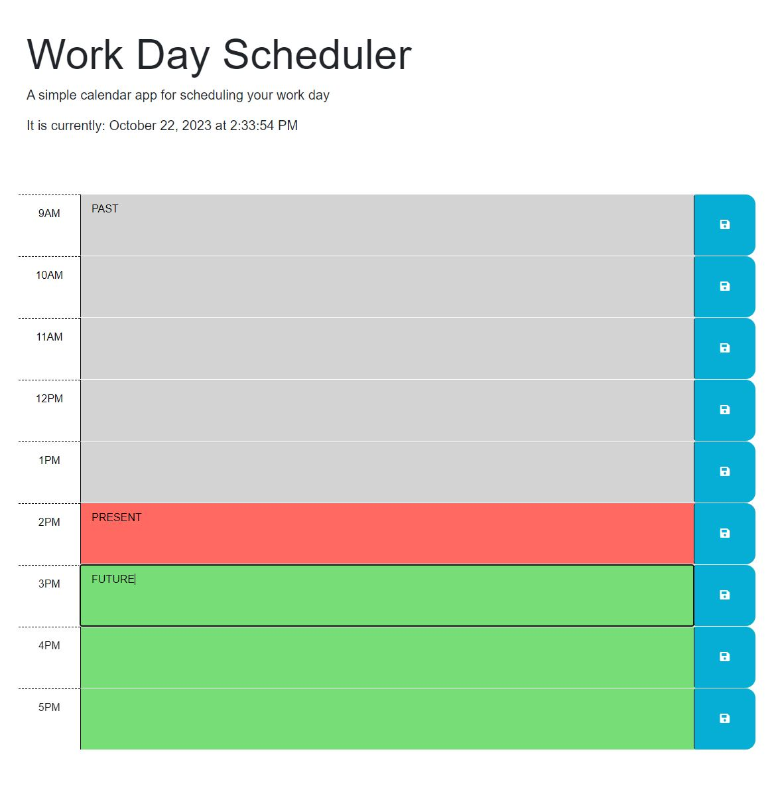

# Work Day Scheduler

## Project Description

The Module 5 Challenge objective was to create a simple calendar application that allows a user to save events for each hour of a typical working day (9am–5pm). This app will run in the browser and feature dynamically updated HTML and CSS powered by jQuery.

## Deployment Screenshot

[Deployment Link]

## Comments

- Added the current date and time to the header using day.js.
- Created time blocks for standard business hours of 9am to 5pm.
- The time blocks are color-coded to indicate whether it is in the past, present, or future.
- Each time block can have an event added to it and can be saved to localStorage.
- When the page is refreshed, the saved event will persist.

## Credits

- Starter code was provided by the UC Davis Bootcamp.
- Project was completed by Travis Fowlston

## License

- N/A
